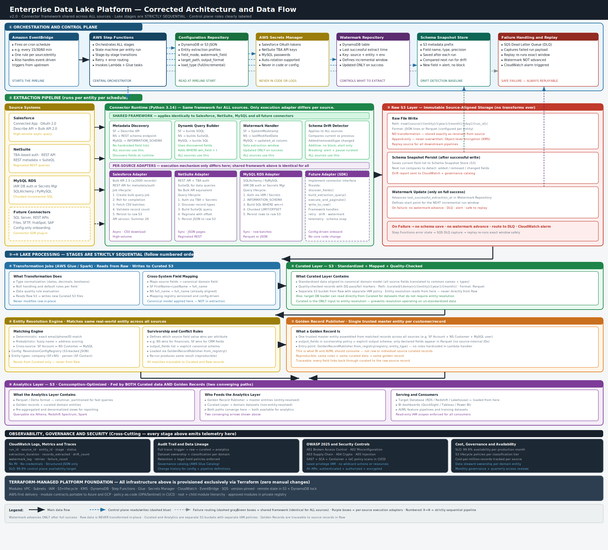
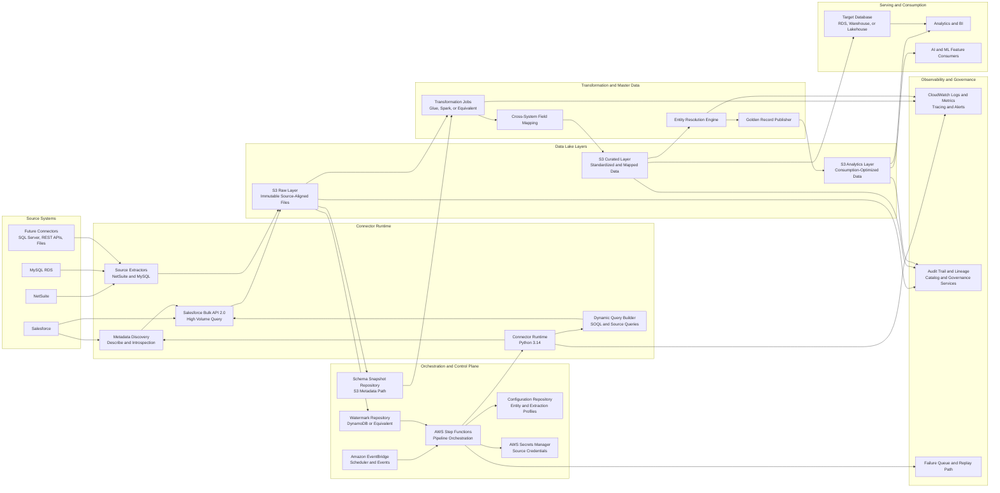
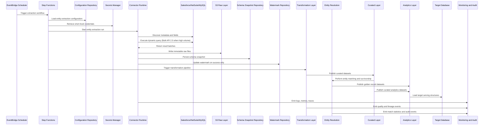

# Enterprise Data Lake Extraction Platform
## Comprehensive Requirements & GitHub Copilot Implementation Specification

Version: 2.0
Date: 2026-06-11

This document expands the original high-level specification into implementation-ready architecture and delivery guidance.

Global implementation constraints:

- Use Python 3.14.x as the default runtime baseline for all implementation planning unless a dependency compatibility exception is formally approved.
- Pin production builds to a tested Python 3.14 patch release and review quarterly for security and compatibility updates.
- Use Terraform as the infrastructure-as-code standard (not AWS CDK) to preserve cloud portability.
- AWS is the primary cloud for initial delivery; design abstractions, naming, and contracts to allow future Azure and GCP adoption.
- Do not hardcode Salesforce fields.
- Do not create one extractor per Salesforce object.
- Raw extraction remains isolated from transformation and entity resolution.
- All APIs must be authenticated and authorized.
- All services must enforce least privilege.
- Secrets must be sourced from cloud secret-management services.
- Credentials, tokens, and PII must never be logged.

---

# 1. Executive Summary

## Detailed Requirements

- Deliver a metadata-driven, connector-based extraction platform for Salesforce, NetSuite, and MySQL RDS with extension points for future systems.
- Support full and incremental extraction patterns with watermark management.
- Implement schema discovery and schema drift detection without interrupting raw ingestion for additive changes.
- Establish three data lake layers: Raw, Curated, and Analytics.
- Support entity resolution and golden record creation downstream from raw extraction.
- Enable target database creation and publish curated datasets for analytics consumption.

## Best Practices

- Separate orchestration, extraction, storage, and transformation concerns.
- Prefer configuration and metadata contracts over conditional source-specific code.
- Maintain immutable run identifiers and deterministic outputs for auditability.

## Design Decisions

- Metadata-first ingestion architecture is mandatory.
- AWS-first deployment with cloud-neutral patterns and Terraform modules.
- Shared connector framework for all sources with per-source adapters.

## Alternatives Considered

- Object-specific extractors for Salesforce objects.
- Monolithic ETL jobs combining extract, transform, and matching.
- AWS-only abstractions tightly coupled to service-specific SDK patterns.

## Recommended Approach

- Build a connector runtime that accepts entity configuration, discovers schema dynamically, builds extraction queries, executes extraction, and writes raw immutable files.
- Trigger transformation and matching only after raw extraction, schema snapshot, and watermark persistence complete successfully.

## Security Requirements

- Security-by-default posture across compute, storage, identity, and transport.
- End-to-end encryption in transit and at rest.
- Centralized secret management and mandatory rotation controls.

## Least Privilege Requirements

- Service identities scoped to per-environment and per-function permissions.
- No wildcard action or resource permissions.

## Naming Standards

- Names must reflect business capability and technical responsibility.
- Prohibited generic names include helper, util, common, manager, phase1, and phase2.

## Operational Considerations

- Define runbook ownership for ingestion failures, drift alerts, and replay operations.
- Enforce SLO-driven monitoring and alerting.

## Acceptance Criteria

- Platform architecture review board approves design as implementation-ready.
- At least one end-to-end source-to-raw-to-curated flow is documented with operational controls.

---

# 2. Business Requirements

## Detailed Requirements

- Current production connectors: Salesforce, NetSuite, MySQL RDS.
- Planned connectors: Dynamics 365, HubSpot, SAP, PostgreSQL, REST APIs, CSV/Excel, SFTP.
- Business outcomes: centralized raw repository, trusted curated entities, entity resolution, golden records, analytics readiness, and AI/ML feature generation pathways.

## Best Practices

- Prioritize connectors by data value, extraction complexity, and change frequency.
- Define source ownership and SLA per connector.

## Design Decisions

- Business onboarding uses configuration records and connector registration, not code forks.
- Data products map to domain-aligned curated zones.

## Alternatives Considered

- One-off integration projects per source team.
- Building source onboarding as code-only changes.

## Recommended Approach

- Establish a standardized source onboarding process: source registration, credential registration, entity mapping, extraction profile, and acceptance validation.

## Security Requirements

- Data classification policy applied to every source entity before extraction activation.

## Least Privilege Requirements

- Source credentials scoped to read-only access and approved entities only.

## Naming Standards

- Source IDs and entity IDs must be stable and human-readable, for example salesforce-account, netsuite-customer.

## Operational Considerations

- Maintain a source onboarding checklist with security, governance, and operational sign-off gates.

## Acceptance Criteria

- Approved onboarding templates exist for Salesforce, NetSuite, and MySQL RDS.
- New source onboarding can be completed without application code changes.

---

# 3. High Level Architecture

## Detailed Requirements

Architecture flow:

Event Scheduler
-> Workflow Orchestrator
-> Source Configuration Repository
-> Connector Runtime
-> Metadata Discovery
-> Dynamic Query Generation
-> Full/Incremental Extraction
-> Raw Layer Write
-> Schema Snapshot Persist
-> Schema Drift Evaluation
-> Watermark Update
-> Transformation Trigger
-> Curated Layer Publish
-> Entity Resolution
-> Golden Record Publish (Mastered Entities)
-> Analytics Layer Publish (Curated and Golden Datasets)
-> Target Database Build and Load (Serving Store)
-> Analytics and Application Consumption

## Architecture Diagram (Data Flow and Services)

The visual architecture above is the primary reference diagram. The Mermaid definitions below are retained as editable source diagrams.

Terminology clarification for downstream stages:

- Golden Record: a mastered entity dataset created by matching and survivorship across source systems. It is not a replacement for every downstream dataset.
- Analytics Layer: a consumption-optimized data layer that can contain both curated domain datasets and golden record datasets.
- Target Database: the serving database or warehouse loaded from curated and/or analytics outputs for BI tools, APIs, and applications.

## Runtime Sequence Diagram

## Best Practices

- Keep orchestration state externalized.
- Ensure each stage emits machine-readable status events.
- Use idempotent stage boundaries with replay support.

## Design Decisions

- Step-based orchestration with explicit stage contracts.
- Raw, Curated, and Analytics layers are physically and logically separated.

## Alternatives Considered

- Single long-running job without stage boundaries.
- Direct source-to-curated load bypassing raw layer.

## Recommended Approach

- Implement a canonical pipeline contract for each stage with standard metadata: run_id, source_id, entity_id, extraction_window, schema_version, record_count, and status.

## Security Requirements

- Private network connectivity where supported.
- Encrypted inter-service communication and signed service identity tokens.

## Least Privilege Requirements

- Stage service roles must only access required queues, storage prefixes, and metadata entries.

## Naming Standards

- Use names aligned to stage responsibility, such as extraction-orchestration-workflow and schema-drift-evaluation-service.

## Operational Considerations

- Define retry policies per stage and dead-letter handling for terminal failures.

## Acceptance Criteria

- Architecture decision record includes stage boundaries, failure behavior, and replay behavior.
- Cross-layer data movement is fully documented and traceable.

---

# 4. Repository Structure

## Detailed Requirements

- Organize by domain: connector_runtime, orchestration, schema_management, governance, observability, infrastructure, ci_cd.
- Separate runtime code, Terraform modules, deployment manifests, and documentation.
- Keep source-specific adapters under clear folders without duplicating framework logic.

## Best Practices

- Keep modules cohesive and dependency directions explicit.
- Avoid cyclic imports and transitive hidden dependencies.

## Design Decisions

- Use a layered package structure: interfaces, implementations, orchestration, persistence, and contracts.

## Alternatives Considered

- Flat repository with mixed scripts.
- Source-specific repositories with duplicated core logic.

## Recommended Approach

- Establish a monorepo with strict domain boundaries and shared contracts package.

## Security Requirements

- Secrets and credentials never stored in repository.
- Enable repository security scanning and branch protection.

## Least Privilege Requirements

- CI identities scoped to specific environments and deployment actions.

## Naming Standards

- File, class, method, variable, and module names must describe exact responsibility.
- Prohibit ambiguous labels, including helper, util, manager, and processor.

## Operational Considerations

- Include environment-specific deployment directories with clear promotion flow.

## Acceptance Criteria

- Repository linter and review checklist enforce naming and structure standards.
- New connector can be added without modifying unrelated modules.

---

# 5. Naming Standards

## Detailed Requirements

- Naming must be deterministic, meaningful, and consistent across code, Terraform modules, CI jobs, cloud resources, and datasets.

## Best Practices

- Use verb-noun for methods and noun-role for classes.
- Include source and entity context where ambiguity is possible.

## Design Decisions

- Enforce naming via lint rules and code review gates.

## Alternatives Considered

- Team-specific free-form naming.
- Generic shared names that hide intent.

## Recommended Approach

- Adopt a naming dictionary and enforce patterns in templates and pull request checks.

## Security Requirements

- Resource names must not leak sensitive source details or secrets.

## Least Privilege Requirements

- Identity names must indicate scope and purpose, for example ingestion_salesforce_read_role.

## Naming Standards

- Good class examples: SalesforceMetadataClient, NetSuiteQueryPlanner, MySqlIncrementalExtractor, SchemaDriftDetector, WatermarkRepository.
- Good method examples: discover_queryable_fields, build_incremental_soql_query, update_watermark_after_success.
- Good property examples: last_successful_watermark, schema_snapshot_location, extracted_record_count.
- Disallowed generic names: helper, utils, common, manager, phase1, phase2.

## Operational Considerations

- Publish naming guide as a mandatory onboarding artifact.

## Acceptance Criteria

- Pull requests with prohibited generic naming fail validation.

---

# 6. Security Requirements

## Detailed Requirements

- All APIs require authentication and authorization.
- Service-to-service calls require workload identities.
- Secrets managed by cloud-native secret services with rotation.
- Logs and traces must redact sensitive values.
- PII handling policy applies across storage, transport, and observability.

## Best Practices

- Apply zero-trust principles between platform components.
- Use short-lived credentials and token exchange over static secrets.
- Require temporary credentials for both human and workload access paths where platform support exists.

## Design Decisions

- AWS Secrets Manager is primary secret store for AWS deployments.
- Abstraction layer supports Azure Key Vault and GCP Secret Manager in future.

## Alternatives Considered

- Environment-variable-only credential handling.
- Static credentials in deployment config files.

## Recommended Approach

- Implement a secrets access service with strict audit logging, rotation metadata, and runtime retrieval.

## Security Requirements

- Encrypt all buckets, databases, and message stores.
- Mandatory TLS for all network paths.
- Centralized threat detection and security event forwarding.

## Least Privilege Requirements

- Restrict each service account to minimal read/write actions per resource and environment.
- Use policy conditions and policy validation checks to constrain scope, and periodically generate refined permissions from observed access patterns.

## Naming Standards

- Security artifacts named by environment, capability, and scope, for example prod-extraction-secrets-policy.

## Operational Considerations

- Quarterly access review and immediate revocation process for offboarding.
- Use automated access analysis findings to remove unused permissions, roles, and credentials.

## Acceptance Criteria

- Security architecture review approves IAM, secrets, encryption, and logging controls.
- Penetration and configuration review show no critical open issues.

---

# 7. OWASP Requirements

## Detailed Requirements

- Implement controls aligned to OWASP Top 10:2025 categories:
  - A01: Broken Access Control
  - A02: Security Misconfiguration
  - A03: Software Supply Chain Failures
  - A04: Cryptographic Failures
  - A05: Injection
  - A06: Insecure Design
  - A07: Authentication Failures
  - A08: Software or Data Integrity Failures
  - A09: Security Logging and Alerting Failures
  - A10: Mishandling of Exceptional Conditions

## Best Practices

- Threat model each connector and ingestion stage.
- Validate all external inputs from APIs, files, and config repositories.

## Design Decisions

- Security test evidence required at pull request and release stages.

## Alternatives Considered

- Annual-only security validation.
- Manual vulnerability checks without automation.

## Recommended Approach

- Integrate static analysis, dependency scanning, container scanning, and IaC policy scanning into CI/CD.

## Security Requirements

- Harden runtime containers and execution environments.
- Sign release artifacts and verify provenance before deployment.

## Least Privilege Requirements

- Security scanners run with read-only repository and artifact access unless mutation is required for remediation workflows.

## Naming Standards

- Security findings and tickets must reference service, environment, severity, and control category.

## Operational Considerations

- Define SLA for remediation by severity and enforce release blocking for critical vulnerabilities.
- Re-baseline control mappings whenever OWASP publishes a new major Top 10 release.

## Acceptance Criteria

- CI pipeline includes OWASP-aligned controls and documented pass/fail gates.

---

# 8. Salesforce Extraction Requirements

## Detailed Requirements

- Discover Salesforce object metadata dynamically through Describe APIs.
- Build SOQL dynamically using discovered fields and entity extraction rules.
- Support field modes: all, standard, custom, includeOnly.
- Handle custom fields and newly added fields without code changes.
- Support Bulk API 2.0 extraction for high-volume entities.
- Enforce rule: no hardcoded Salesforce field lists and no object-specific extractor classes.

## Best Practices

- Cache metadata per run with expiration strategy.
- Exclude unsupported and non-queryable fields automatically.

## Design Decisions

- Single Salesforce connector runtime with metadata-driven entity configuration.

## Alternatives Considered

- One extractor module per object.
- Fixed SOQL templates with manually curated fields.

## Recommended Approach

- Use a metadata discovery component that emits a queryable field contract consumed by a dynamic SOQL builder.

## Security Requirements

- OAuth tokens stored and retrieved from secrets service only.
- API scopes restricted to minimum required Salesforce objects and actions.

## Least Privilege Requirements

- Salesforce integration user profile grants read-only permissions for approved objects and fields.

## Naming Standards

- Use source-specific but responsibility-focused names, such as salesforce_metadata_discovery_client and salesforce_bulk_query_orchestrator.

## Operational Considerations

- Track Salesforce API limits, throttling behavior, and extraction window impacts.

## Acceptance Criteria

- Adding a new Salesforce object requires configuration only.
- Field additions in Salesforce are extracted automatically after metadata refresh.

---

# 9. Bulk API Strategy

## Detailed Requirements

- Use Salesforce Bulk API 2.0 for initial loads, historical loads, and large incremental loads.
- Use REST API for authentication, metadata discovery, and small control-plane interactions.
- Use Bulk API 2.0 as the default path when expected result volumes are 2,000 or more records.

## Best Practices

- Partition high-volume loads by extraction windows.
- Monitor query job lifecycle and enforce timeout handling.
- Check API limits through Salesforce limits endpoints and enforce platform throttling controls.

## Design Decisions

- Bulk API 2.0 is primary data-plane extraction mechanism for Salesforce.

## Alternatives Considered

- REST API-only extraction for all workloads.
- Bulk API 1.0 legacy workflows.

## Recommended Approach

- Implement a job orchestration pattern: create job, monitor status, fetch results, validate counts, persist raw files, and close run.

## Security Requirements

- Sign and validate requests through authenticated sessions with secure token handling.

## Least Privilege Requirements

- Restrict job creation and query access to required objects only.

## Naming Standards

- Include transport and role intent in names, such as bulk_api_query_job_controller.

## Operational Considerations

- Define fallback behavior for job expiration, API throttling, and partial result retrieval.

## Acceptance Criteria

- Bulk extraction path supports million-record entities with controlled retries and resumability.

---

# 10. Configuration Driven Design

## Detailed Requirements

- All source entities configured via versioned configuration artifacts.
- Configuration supports entity activation, load type, watermark field, field mode, include/exclude fields, destination paths, retention, and quality policies.
- Supported minimum configuration keys include: entity, load_type, watermark_field, field_mode, include_fields, exclude_fields, target_path, schema_path, output_format.

## Best Practices

- Validate configuration schema before deployment.
- Support environment overrides with clear precedence.

## Design Decisions

- Configuration repository serves as source of truth for connector runtime.

## Alternatives Considered

- In-code constant definitions.
- Runtime manual parameter entry.

## Recommended Approach

- Define a strict configuration contract with backward-compatible evolution and semantic versioning.

## Security Requirements

- Protect configuration repository with access controls and change approval.

## Least Privilege Requirements

- Runtime can read active configuration; only deployment automation can publish config changes.

## Naming Standards

- Configuration keys use explicit names, such as watermark_field, schema_snapshot_location, and extraction_window_days.

## Operational Considerations

- Maintain configuration rollout strategy with canary activation for new entities.

## Acceptance Criteria

- New entity onboarding and behavior changes are completed without code changes.

---

# 11. Watermark Framework

## Detailed Requirements

- Support incremental extraction using source-managed fields such as SystemModstamp and LastModifiedDate.
- Persist watermark state per source, entity, environment, and run status.
- Update watermark only after successful extraction, raw persistence, and run validation.

## Best Practices

- Store both lower and upper watermark bounds for replay-safe windows.
- Include overlap windows to mitigate late-arriving updates.

## Design Decisions

- Watermark repository is a dedicated component with optimistic concurrency controls.

## Alternatives Considered

- File-based watermark tracking.
- In-memory watermark state.

## Recommended Approach

- Use durable metadata storage with transaction-safe update semantics and run correlation IDs.

## Security Requirements

- Watermark storage encrypted with audit trails for updates.

## Least Privilege Requirements

- Only extraction runtime can write watermarks; monitoring services receive read-only access.

## Naming Standards

- Watermark records include explicit dimensions: source_id, entity_id, environment, last_successful_watermark.

## Operational Considerations

- Provide replay operation to re-run a past extraction window safely.

## Acceptance Criteria

- No watermark is advanced when run status is failed or partially completed.

---

# 12. Schema Drift Framework

## Detailed Requirements

- Compare current schema snapshot against previous successful snapshot.
- Detect added fields, removed fields, type changes, precision changes, scale changes, and length changes.
- Capture drift classification: non-breaking, potentially breaking, and breaking.

## Best Practices

- Persist immutable schema snapshots with version and timestamp.
- Alert on risky drift before curated transformations execute.

## Design Decisions

- Additive drift in raw layer does not block extraction.

## Alternatives Considered

- Fail-on-any-drift extraction strategy.
- Manual schema tracking in spreadsheets.

## Recommended Approach

- Maintain automated drift detection with policy rules per source and entity.

## Security Requirements

- Drift reports must not expose sensitive field values.

## Least Privilege Requirements

- Drift service has read access to snapshots and write access to drift reports only.

## Naming Standards

- Snapshot and report names include source, entity, schema_version, and extraction_date.

## Operational Considerations

- Define escalation paths for breaking drift and required transformation updates.

## Acceptance Criteria

- Schema drift report produced for every extraction run.
- Additive fields appear in raw output without extraction failure.

---

# 13. Raw Layer Standards

## Detailed Requirements

- Raw layer stores source records exactly as extracted.
- No cleansing, renaming, normalization, deduplication, or enrichment in raw.
- Retain extraction metadata alongside payload metadata for lineage.

## Best Practices

- Use append-only writes and immutable objects.
- Partition raw storage by source, entity, and extraction date/time.

## Design Decisions

- Raw is the system-of-ingestion record and replay source.

## Alternatives Considered

- Applying transformations during extraction.
- Overwriting prior raw files for storage savings.

## Recommended Approach

- Preserve raw fidelity and perform all transformation downstream in curated workflows.

## Security Requirements

- Restrict direct raw access and enable object-level encryption and access logging.

## Least Privilege Requirements

- Extraction runtime write-only to raw prefixes; downstream processing read-only where required.

## Naming Standards

- Raw paths include source_id, entity_id, extraction_timestamp, and run_id.

## Operational Considerations

- Define retention, archive, and legal hold policies per data classification.

## Acceptance Criteria

- Raw records match source payload structure with no transformation artifacts.

---

# 14. Curated Layer Standards

## Detailed Requirements

- Curated layer performs business transformations, standardization, type normalization, and quality checks.
- Implement cross-system field mapping and canonical domain model alignment.
- Curated outputs support downstream analytics and target database load.

## Best Practices

- Version transformation logic and canonical models.
- Keep transformation rules declarative where practical.

## Design Decisions

- Curated is separate pipeline stage from raw extraction and entity resolution.

## Alternatives Considered

- Curated-on-read from raw at query time only.
- Embedded transformation logic in connector runtime.

## Recommended Approach

- Implement transformation service with mapping registry and data quality policy evaluation.

## Security Requirements

- Apply masking/tokenization rules for sensitive attributes in curated datasets where required.

## Least Privilege Requirements

- Curated jobs read raw and write curated; analytics consumers receive read-only curated access.

## Naming Standards

- Curated datasets named by domain and entity purpose, for example customer_profile_curated.

## Operational Considerations

- Define schema contract publication and consumer notification process.

## Acceptance Criteria

- Curated outputs satisfy mapping, quality, and lineage requirements and are validated before publication.

---

# 15. Entity Resolution Requirements

## Detailed Requirements

- Support deterministic and probabilistic matching across name, address, email, phone, and domain-specific identifiers.
- Support cross-system mapping where source field shapes differ, such as FirstName plus LastName versus FullName.
- Generate golden records with survivorship and source confidence rules.
- Treat golden records as mastered entity outputs; publish additional non-mastered curated datasets separately for analytics use cases.

## Best Practices

- Keep match rules externally configurable and versioned.
- Track explainability for every match decision.

## Design Decisions

- Entity resolution executes after curated standardization, never in raw ingestion.

## Alternatives Considered

- Single exact-match strategy only.
- Manual deduplication in downstream reporting tools.

## Recommended Approach

- Implement a matching engine with rule sets, scoring thresholds, conflict handling, and golden record survivorship policies.

## Security Requirements

- Restrict access to match keys and identity attributes.
- Ensure PII-safe observability for matching diagnostics.

## Least Privilege Requirements

- Matching services access only required curated entities and write-only to resolved outputs.

## Naming Standards

- Names must indicate matching function, such as customer_identity_match_rule_set and golden_record_survivorship_policy.

## Operational Considerations

- Establish periodic precision and recall evaluation and manual review workflows.

## Acceptance Criteria

- Golden record generation is reproducible and traceable to source records and rule versions.

---

# 16. Observability

## Detailed Requirements

- Mandatory structured logging, metrics, and distributed tracing.
- Required log dimensions: run_id, source_id, entity_id, stage, status, duration_ms, retry_count.
- Required metrics: extraction_duration, records_extracted, records_failed, retries, schema_drift_count, watermark_lag.
- Observability implementation must support full execution traceability from trigger to final publication state.

## Best Practices

- Use consistent telemetry schemas across all services.
- Define alert thresholds tied to SLOs.

## Design Decisions

- Centralized observability stack with searchable logs and metric dashboards.

## Alternatives Considered

- Unstructured text logs only.
- Service-local metrics without central aggregation.

## Recommended Approach

- Adopt an observability contract and enforce telemetry validation in integration tests.

## Security Requirements

- Scrub credentials, access tokens, and PII before emission.

## Least Privilege Requirements

- Monitoring tools have read-only access to telemetry stores.

## Naming Standards

- Dashboard and alarm names include source, environment, stage, and severity.

## Operational Considerations

- Maintain runbooks for critical alerts with decision trees and escalation contacts.

## Acceptance Criteria

- Operators can identify failed entities, root-cause stage, and remediation path within agreed mean time to detect.

---

# 17. Reliability

## Detailed Requirements

- Implement retry strategies for transient faults: timeouts, throttling, temporary network failures.
- Do not retry deterministic failures: invalid credentials, invalid object names, invalid configuration.
- Ensure idempotent reruns without data corruption.
- Availability target for the extraction control plane is 99.9 percent or higher per production month.

## Best Practices

- Use exponential backoff with jitter.
- Track retry attempts per stage and enforce circuit-breaker rules.

## Design Decisions

- Failure classification drives retry versus fail-fast behavior.

## Alternatives Considered

- Blind retry for all errors.
- No retry with manual restart only.

## Recommended Approach

- Implement policy-driven reliability framework with per-source and per-stage fault policies.

## Security Requirements

- Preserve audit trail for retries and recovery actions.

## Least Privilege Requirements

- Recovery tooling receives scoped write access limited to failed run replay actions.

## Naming Standards

- Reliability artifacts use explicit names, such as extraction_retry_policy and run_replay_controller.

## Operational Considerations

- Define RTO and RPO objectives by source and entity criticality.

## Acceptance Criteria

- Reprocessing a failed run does not duplicate curated records and does not regress watermark correctness.

---

# 18. Testing Standards

## Detailed Requirements

- Mandatory testing levels: unit, integration, contract, security, performance, and data-quality validation.
- Coverage target remains 80 percent minimum for critical runtime packages.

## Best Practices

- Test metadata-driven behaviors with synthetic schema and drift scenarios.
- Validate connector compatibility in isolated integration environments.
- Apply SOLID design principles and dependency inversion for core runtime components.
- Prefer small, cohesive classes with explicit dependencies and typed interfaces.
- Avoid god classes, hidden dependencies, and mutable global state.

## Design Decisions

- Test pyramid with fast unit tests and selective high-value end-to-end tests.

## Alternatives Considered

- Integration-only strategy.
- Manual QA-only validation.

## Recommended Approach

- Automate test execution in CI with environment-specific contract test suites.

## Security Requirements

- Include secret handling, authorization, and logging redaction tests.

## Least Privilege Requirements

- Test identities use non-production, least-privileged credentials and isolated resources.

## Naming Standards

- Test suite names reflect behavior under test, such as schema_drift_detection_contract_test.

## Operational Considerations

- Maintain a test data strategy with synthetic and masked datasets.

## Acceptance Criteria

- Release pipeline blocks on failed mandatory tests and unmet coverage thresholds.

---

# 19. Infrastructure as Code

## Detailed Requirements

- Terraform is the mandatory IaC standard.
- Provision orchestration, storage, identity, secrets, observability, and metadata persistence.
- Module design must separate cloud-agnostic interfaces from cloud-specific implementations.
- Use a root-module and child-module hierarchy with explicit module sources and version pinning.

## Best Practices

- Use reusable Terraform modules with explicit inputs and outputs.
- Enforce policy-as-code and drift detection in deployment pipelines.
- Publish approved internal modules in a controlled registry and consume modules by pinned versions only.

## Design Decisions

- AWS provider is primary initial implementation target.
- Terraform module contracts designed for future Azure and GCP equivalence.

## Alternatives Considered

- AWS CDK TypeScript.
- ClickOps manual provisioning.

## Recommended Approach

- Build environment modules for networking, storage, compute orchestration, IAM, secrets, and observability, with shared naming and tagging conventions.

## Security Requirements

- Enforce encryption defaults, private connectivity, security logging, and policy compliance in Terraform plans.

## Least Privilege Requirements

- Terraform execution roles scoped by environment and module with least required permissions.

## Naming Standards

- Terraform module and resource names include environment, capability, and purpose, such as prod_data_lake_raw_storage.

## Operational Considerations

- Use remote state with locking, versioning, and restricted access.

## Acceptance Criteria

- Entire platform can be provisioned, updated, and destroyed through Terraform workflows without manual infrastructure steps.

---

# 20. CI/CD Standards

## Detailed Requirements

- Pipeline stages: lint, type checks, unit tests, integration tests, security scans, dependency scans, package build, release promotion, deployment.
- Enforce approvals for production promotion.

## Best Practices

- Keep artifacts immutable and signed.
- Use environment promotion rather than rebuild-per-environment.

## Design Decisions

- Security and quality gates are non-optional.

## Alternatives Considered

- Single-stage deployment pipelines.
- Manual release process.

## Recommended Approach

- Implement multi-environment pipelines with branch protection, release tagging, and rollback automation.

## Security Requirements

- Scan code, dependencies, containers, and Terraform plans before deployment.

## Least Privilege Requirements

- CI/CD service principals restricted by environment and action scope.

## Naming Standards

- Pipeline and job names indicate stage and environment, such as deploy_curated_pipeline_prod.

## Operational Considerations

- Define rollback playbooks and deployment freeze controls for critical windows.

## Acceptance Criteria

- Production deployment is blocked on critical security findings and failed required tests.

---

# 21. Performance Requirements

## Detailed Requirements

- Support extraction of millions of Salesforce records per entity using Bulk API 2.0.
- Support concurrent entity extraction with bounded resource controls.
- Support incremental processing windows aligned to source change rates.

## Best Practices

- Tune parallelism by source limits and workload class.
- Use columnar formats in curated and analytics layers for efficient queries.

## Design Decisions

- Throughput optimization prioritized without compromising data correctness.

## Alternatives Considered

- Serial extraction for all entities.
- Unlimited parallel jobs without quota awareness.

## Recommended Approach

- Implement adaptive concurrency controls with source-specific rate limit awareness and backpressure.

## Security Requirements

- Performance optimizations must not bypass security controls or logging.

## Least Privilege Requirements

- Scaling components retain least-privileged identities regardless of worker count.

## Naming Standards

- Performance profiles named by source and workload, such as salesforce_high_volume_incremental_profile.

## Operational Considerations

- Track cost-per-million-records and latency percentiles by stage.

## Acceptance Criteria

- Documented benchmark demonstrates target throughput within operational cost and reliability constraints.

---

# 22. Governance

## Detailed Requirements

- Maintain full audit trail, lineage, ownership, and change history for datasets and pipeline configurations.
- Define data steward responsibilities for each domain.
- Maintain governance controls for retention, privacy, and data use approvals.

## Best Practices

- Automate lineage capture at ingestion and transformation boundaries.
- Integrate data catalog and policy metadata with deployment workflows.

## Design Decisions

- Governance metadata is first-class and versioned.

## Alternatives Considered

- Spreadsheet-based governance tracking.
- Governance after deployment only.

## Recommended Approach

- Implement policy-backed governance service integrated with ingestion runtime and curated publication.

## Security Requirements

- Governance repositories and catalogs require strong access control and audit logging.

## Least Privilege Requirements

- Data stewards and operators receive role-specific permissions by domain scope.

## Naming Standards

- Governance artifacts include domain, data_product, owner, and policy_version identifiers.

## Operational Considerations

- Run monthly governance reviews for policy compliance and ownership currency.

## Acceptance Criteria

- Every production dataset has registered owner, lineage path, classification, and retention policy.

---

# 23. Future Multi-Source Connector Framework

## Detailed Requirements

- Connector framework must support Salesforce, NetSuite, MySQL RDS initially.
- Framework must support onboarding SQL Server, REST APIs, files, and additional SaaS connectors later.
- Connector contract includes discovery, extraction, pagination/chunking, incremental strategy, schema snapshot, and error taxonomy.

## Best Practices

- Separate connector interface contracts from provider-specific implementation details.
- Reuse shared runtime capabilities: retry, telemetry, watermarking, and schema tracking.

## Design Decisions

- Plugin-style connector registration with capability declarations.

## Alternatives Considered

- Source-specific pipelines built independently.
- Monolithic connector with source condition branches.

## Recommended Approach

- Build a connector SDK layer with standard lifecycle hooks and validation contracts.

## Security Requirements

- Connector adapters must use secure credential retrieval and source-specific least access scopes.

## Least Privilege Requirements

- Connector service identities and source credentials are isolated per source type and environment.

## Naming Standards

- Connector modules must reflect source and function, such as netsuite_metadata_adapter and mysql_incremental_query_planner.

## Operational Considerations

- Define connector certification checklist before production onboarding.

## Acceptance Criteria

- New connector can be integrated by implementing connector contract and configuration, without core runtime refactoring.

---

# 24. GitHub Copilot Rules

## Detailed Requirements

- Copilot-assisted implementation must follow this specification and linked architecture decisions.
- Generated content must satisfy naming, security, least privilege, and observability standards.

## Best Practices

- Require developers to provide context files to Copilot before generation.
- Use implementation checklists per feature to validate generated outputs.

## Design Decisions

- Copilot is an accelerator, not a replacement for architecture, security, and review controls.

## Alternatives Considered

- Unconstrained code generation.
- Minimal review of generated artifacts.

## Recommended Approach

- Enforce pull request templates that require evidence for security, tests, and architecture alignment.

## Security Requirements

- Never prompt or generate real credentials or sensitive production data.

## Least Privilege Requirements

- Generated IAM and access policies must be resource-scoped and action-scoped.

## Naming Standards

- Generated names must comply with this document and reject prohibited generic identifiers.

## Operational Considerations

- Track post-merge defect and security issue rates for generated code to improve prompt and review standards.

## Acceptance Criteria

- Implementation pull requests demonstrate conformance to this specification and pass all policy gates.

---

# 25. Final Architecture Principles

## Detailed Requirements

- Security First: controls are built in, not added later.
- Configuration First: behavior is data-driven and environment-aware.
- Metadata First: discovery and schema contracts govern extraction.
- Least Privilege: every identity is constrained to required scope.
- Cloud Portable by Design: AWS-first implementation with Terraform and portable contracts.
- Observable and Auditable: every stage is traceable with metrics and logs.
- Extensible and Testable: connector framework and verification strategy support growth.
- Cost-Aware Operations: platform includes optimization policies and usage transparency.

## Best Practices

- Review principles at design, implementation, and release checkpoints.

## Design Decisions

- Principles are enforceable controls, not optional guidance.

## Alternatives Considered

- Principle statements without measurable enforcement.

## Recommended Approach

- Bind principles to automated checks in CI/CD, IaC policy validation, and architecture review.

## Security Requirements

- Security controls are mandatory release criteria.

## Least Privilege Requirements

- Least privilege is verified continuously through access reviews and policy scanning.

## Naming Standards

- Principle identifiers and policies use explicit names mapped to control objectives.

## Operational Considerations

- Use quarterly architecture health assessments to measure principle compliance, platform risk, and cost trends.

## Acceptance Criteria

- Governance board approves that all principles are mapped to controls, owners, and measurable KPIs.

---

# 26. External Standards Baseline

## Detailed Requirements

- Architecture and security controls must be validated against authoritative vendor and standards sources at least quarterly.

## Best Practices

- Track source URLs and validation date in architecture review records.

## Design Decisions

- This specification is aligned to public documentation current as of 2026-06-11.

## Alternatives Considered

- Internal-only standards tracking without external verification.

## Recommended Approach

- Maintain a recurring standards validation checklist for runtime, API, security, and IaC assumptions.

## Security Requirements

- Standards updates with security impact must trigger risk review and remediation planning.

## Least Privilege Requirements

- Access to modify standards baselines is limited to architecture and security approvers.

## Naming Standards

- Baseline records use explicit labels: standard_name, version, source_url, validated_on.

## Operational Considerations

- Required reference baselines:
  - Python downloads and version status: https://www.python.org/downloads/
  - Salesforce Bulk API 2.0 and asynchronous API guidance: https://developer.salesforce.com/docs/atlas.en-us.api_asynch.meta/api_asynch/
  - OWASP Top 10 2025: https://owasp.org/Top10/2025/
  - Terraform introduction and modules guidance: https://developer.hashicorp.com/terraform/intro and https://developer.hashicorp.com/terraform/language/modules
  - AWS IAM and Well-Architected security guidance: https://docs.aws.amazon.com/IAM/latest/UserGuide/best-practices.html and https://docs.aws.amazon.com/wellarchitected/latest/security-pillar/welcome.html

## Acceptance Criteria

- Architecture sign-off includes dated evidence that baseline references were reviewed and incorporated.

END OF DOCUMENT
